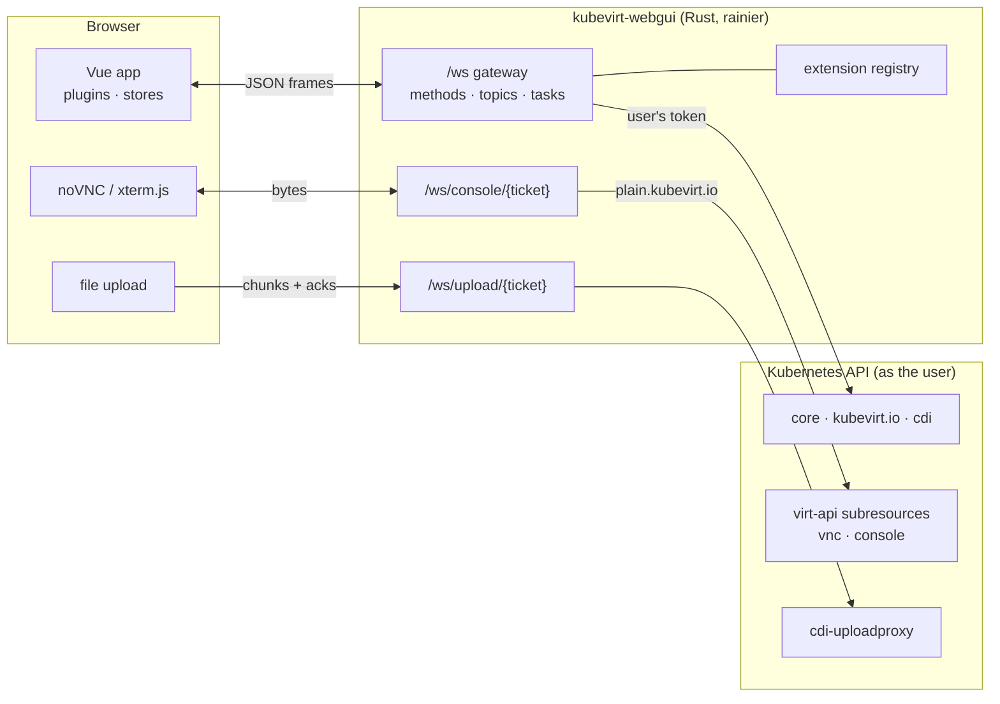

# kubevirt-webgui

An extensible, Proxmox-inspired web interface for **KubeVirt** — libvirt/QEMU
virtual machines running on Kubernetes.

- **Rust backend** on [rainier-framework](https://github.com/safewords/rainier-framework), talking to the Kubernetes API with [kube-rs](https://kube.rs).
- **Vue 3 + Tailwind CSS + Font Awesome** frontend, with noVNC and xterm.js consoles.
- **Every action travels over a WebSocket.** No REST API for the browser: calls, live watches, task logs, metrics, consoles and uploads all use sockets.
- **Cluster authentication.** Users sign in with their own Kubernetes credentials; the server holds no privileges, and Kubernetes RBAC decides what each person can see and do.
- **Extensible on both ends.** Server extensions add gateway methods; browser plugins add screens, toolbar actions, tree views and create-menu entries — built-in or loaded at runtime.

---

## Proxmox → KubeVirt

The layout follows Proxmox VE: a resource tree on the left, the selected object's panels in the middle, the task log along the bottom.

| Proxmox VE | Here | Kubernetes / KubeVirt underneath |
|---|---|---|
| Datacenter | Datacenter | the cluster |
| Node | Node | `Node` (+ `kubevirt.io/schedulable`, CPU model labels) |
| VM (qemu) | Virtual Machine | `VirtualMachine` + `VirtualMachineInstance` |
| Resource pool | Namespace | `Namespace`, `ResourceQuota`, `RoleBinding` |
| Start / Shutdown / Stop / Reboot / Reset / Pause / Resume | same | `virtualmachines/{start,stop,restart}`, `virtualmachineinstances/{softreboot,reset,pause,unpause}` |
| Console (noVNC / xterm.js) | same | `virtualmachineinstances/{vnc,console}` proxied over WebSocket |
| Migrate | Migrate (live) | `VirtualMachineInstanceMigration` |
| Snapshots / Rollback | Snapshots / Restore | `VirtualMachineSnapshot`, `VirtualMachineRestore` |
| Clone | Clone | `VirtualMachineClone` |
| Hardware / Options / Cloud-Init | same | `spec.template.spec`, `cloudInitNoCloud` |
| Storage content: ISO images, templates | Images | CDI `DataVolume`s, `DataSource`s |
| Upload / Download from URL | same | CDI upload proxy / http importer |
| Task log (UPID) | Task log (UPID) | tracked by the server, streamed live |
| Cluster log | Cluster log | Kubernetes `Event`s |
| Maintenance mode | Cordon / Drain | node cordon + live-migrate every guest |
| Permissions, API tokens | Permissions, API tokens | RBAC, `ServiceAccount` `TokenRequest` |
| Firewall | Firewall | `NetworkPolicy` |
| USB passthrough | USB devices | [atomic-usb](https://github.com/safewords/kubevirt-atomic-usb) (plugin) |

## Architecture



### The gateway protocol

One socket, JSON frames:

```jsonc
// a call: one answer
→ { "id": "7", "op": "call", "method": "vm.start", "params": { "namespace": "prod", "name": "db" } }
← { "id": "7", "op": "result", "result": { "task": "UPID:alice:18A…:vm.start:prod/db" } }

// a subscription: events until unsubscribed
→ { "id": "8", "op": "subscribe", "topic": "watch", "params": { "apiVersion": "kubevirt.io/v1", "resource": "virtualmachines" } }
← { "id": "8", "op": "event", "data": { "type": "SYNC", "items": [ … ] } }
← { "id": "8", "op": "event", "data": { "type": "MODIFIED", "object": { … } } }
→ { "id": "8", "op": "unsubscribe" }
← { "id": "8", "op": "end" }
```

Calls run concurrently, so a slow migration never blocks the reads sent after it. The browser client reconnects on its own, resumes the session from its ticket, and re-establishes every subscription.

Long operations return a **task** straight away. The task records each step (`VMI phase: Scheduling`, `migration phase: Running → pve-thin-5`, …) and streams to every browser the user has open, exactly like Proxmox's task viewer.

Consoles use Proxmox's two-step pattern: `console.ticket` over the authenticated gateway returns a one-time ticket (valid for 60 s), and `/ws/console/{ticket}` becomes a raw byte pipe to KubeVirt's `vnc` or `console` subresource, opened with the user's credential.

### Authentication

There is no user database. The login form accepts a **Kubernetes bearer token** — a ServiceAccount token or an OIDC ID token. The server asks the API server who it belongs to (`SelfSubjectReview`) and, from then on, makes every request **with that token**. The browser keeps a ticket (the credential and identity, encrypted with `APP_KEY`), not the token.

Consequences:

- RBAC applies exactly as it would with `kubectl`. A user bound to `kubevirt.io:edit` in one namespace sees and manages that namespace only.
- The GUI greys out actions RBAC would refuse, using batched `SelfSubjectAccessReview`s.
- Deployed in a cluster, the server's own ServiceAccount is bound to **nothing**.
- `AUTH_ALLOW_SERVER_IDENTITY=true` adds "sign in as the server's kubeconfig identity" for a single-user desktop install. Never enable it on a shared deployment.

Tokens for people:

```sh
kubectl create serviceaccount alice -n team-a
kubectl create rolebinding alice-vms -n team-a --clusterrole=kubevirt.io:admin --serviceaccount=team-a:alice
kubectl create token alice -n team-a --duration=8h
```

The Datacenter → Permissions → API Tokens screen does the same from the GUI.

## Disk images: ISOs, VMDKs and other formats

Every disk is a **PersistentVolumeClaim**, filled by CDI (the Containerized Data Importer) through a **DataVolume**:

| You have | DataVolume `source` | What CDI does |
|---|---|---|
| A URL to a `.qcow2`, `.raw`, `.img`, `.vmdk`, `.vdi`, `.vhd(x)` (optionally `.gz`/`.xz`) | `http: { url }` | An importer pod downloads it **inside the cluster** and converts it with `qemu-img` to a raw disk on the PVC. VMDKs need no separate conversion step. |
| A URL to an `.iso` | `http: { url }` | Stored as the PVC's disk image. Attach it to a VM as a `cdrom` (bus `sata`). |
| A file on your machine | `upload: {}` | The browser streams it over `/ws/upload/{ticket}` with acknowledgements; the server forwards it to `cdi-uploadproxy` with a CDI upload token. Converted as above. |
| A container image (`quay.io/containerdisks/…`) | `registry: { url }` | Pulled and written to the PVC. Or use it directly as an ephemeral `containerDisk`. |
| An existing disk or golden image | `pvc: { … }` / `sourceRef` → `DataSource` | Cloned — on Ceph RBD this is a copy-on-write CSI clone and nearly instant. |
| A VM on VMware | `vddk: { … }` | Reads the VMDK straight from vSphere; for bulk moves use Forklift / MTV. |
| A VM on Proxmox VE | `upload: {}` | **Create → Import from Proxmox**: the server reads the disks over SSH and streams them in — see below. |

The **Images** screen is the ISO and template library, like a Proxmox storage's ISO Images and CT Templates content:

- **Download from URL** creates a labelled DataVolume and shows the import progress.
- **Upload** streams a local file over the WebSocket.
- The **Create VM** wizard boots from an ISO by cloning the ISO's PVC into a per-VM CD-ROM disk next to a blank root disk. Each VM gets its own copy because RBD volumes are `ReadWriteOnce`; with CSI cloning that copy costs nothing.

Storage defaults come from the `StorageProfile` for the chosen StorageClass (on `ceph-rbd`: `Block` volume mode, `ReadWriteMany` when possible so VMs can live-migrate).

## Importing from Proxmox VE

**Create → Import from Proxmox** copies a stopped Proxmox VM — settings and disks — into a KubeVirt VM:

1. **Connect.** Enter a Proxmox node, `root` (or another user who may run `pvesh` and `pvesm`) and a password or SSH private key. The wizard shows the node's SSH host key fingerprint first; compare it with `ssh-keygen -lf /etc/ssh/ssh_host_ed25519_key.pub` on the node. Credentials are sent only after you trust the key, and the browser remembers accepted keys and warns if one changes.
2. **Virtual machine.** Every QEMU VM in the Proxmox cluster is listed. Running VMs cannot be picked: a disk that changes while it is read is not a copy.
3. **Settings, Disks, Network.** The configuration arrives mapped, and every choice can be changed:
   - **Firmware and chipset:** SeaBIOS/OVMF and Secure Boot carry over. KubeVirt only offers q35, so i440fx becomes q35.
   - **Identity:** CPU sockets/cores, memory and the SMBIOS UUID and serial carry over.
   - **Disks:** each disk keeps its bus (IDE becomes SATA), serial and boot order.
   - **NICs:** each NIC keeps its model and MAC address, on the pod network or a Multus network.
   - **Windows guests** get Hyper-V enlightenments and their local-time clock.
4. **Confirm.** The YAML to be created is shown, with a list of what differs from Proxmox and what stays behind:
   - EFI variables and TPM contents
   - Snapshots
   - PCI passthrough
   - Rate limits and similar settings

   **Import** runs a dry run first, then starts the import task.

The import task:

- **Checks the source.** It re-reads the VM and refuses if it is running, locked, or its configuration changed since you reviewed it. While copying, it rechecks every 20 seconds over a second SSH connection, and stops if the VM is started on Proxmox mid-copy.
- **Creates the VM stopped,** with an upload DataVolume per disk.
- **Streams each disk** with `pvesm export … raw+size`, compressed with `zstd`, straight into CDI's upload proxy. Nothing is written to temporary files on either side.
  - The stream begins with a 4 KiB zstd frame holding one uncompressed block.
  - This works around a CDI 1.65 bug: its format detection reuses the buffer holding the stream's first 512 bytes while the zstd decoder is still reading them.
  - Without the workaround, a disk whose start compresses into many tiny blocks fails with "reserved block type encountered", or is silently corrupted.
- **Handles local storage.** Disks on a node's local storage (LVM-thin, directories) are read on that node, through the Proxmox cluster's own root SSH.
- **Reports progress live:** bytes copied, rate and time left, in the task viewer and the Tasks panel.
- **Cleans up on failure.** If the import fails or is stopped, the half-imported VM is deleted. The deletion uses background propagation, so the name is free at once and Kubernetes removes the disks and CDI's upload pods afterwards.
- **Leaves Proxmox unchanged.** Keep the Proxmox VM stopped once imported, since both copies have the same MAC address.

The server makes these SSH connections, so it only connects to hosts listed in `PROXMOX_ALLOWED_HOSTS` (names, addresses or CIDR ranges); with it unset, importing is off. Credentials live in the server's memory for the wizard session (30 minutes idle) and the import, and are never stored. ZFS-backed disks are not supported yet (`pvesm` exports them only as ZFS streams).

## Optional integrations

Only Kubernetes itself is assumed. Everything else is detected through API discovery and switched on or off **while the GUI is running**:

| Integration | Detected by | Without it |
|---|---|---|
| KubeVirt | `kubevirt.io/v1` | nodes, namespaces and disks still work; no VM screens |
| CDI | `cdi.kubevirt.io` | disks are plain PVCs; no import, upload or image library |
| VM snapshots, restores | `snapshot.kubevirt.io` | no Snapshots tab |
| VM clones | `clone.kubevirt.io` | no Clone action |
| Instance types / preferences | `instancetype.kubevirt.io` | manual CPU and memory only |
| CSI volume snapshots | `snapshot.storage.k8s.io` | disk snapshot screens hidden, with a note on the VM Snapshots tab |
| metrics-server | `metrics.k8s.io` | usage graphs show "no data" |
| Multus | `k8s.cni.cncf.io` | pod network only |
| [atomic-usb](https://github.com/safewords/kubevirt-atomic-usb) | `atomicusb.safewords.io` | no USB panels, tree view or attach action |

- **In the browser:** discovery is re-read every minute. A plugin whose required APIs appear is set up at once; one whose APIs disappear has its panels, actions and tree views withdrawn and its `teardown()` called — no reload. Datacenter → Extensions shows each one's state and has a **Re-scan cluster** button.
- **On the server:** a method belonging to an extension whose APIs the cluster does not serve answers `ExtensionUnavailable` ("atomic-usb is not available: this cluster does not serve atomicusb.safewords.io/v1alpha1/usbdeviceclaims") instead of an opaque 404. The server rescans discovery before refusing, so a CRD installed a moment ago is picked up.

For atomic-usb specifically, the VM's USB panel offers to enable `devices.clientPassthrough`, which atomic-usb needs, and warns when the running instance predates it.

### Live migration and CPU models

A VM started with the default `host-model` CPU can only migrate to a node with the **same host CPU**. The Migrate dialog marks nodes with a different host CPU and suggests models every node supports. A migration that cannot be placed reports the scheduler's reason in the task log within seconds; KubeVirt itself only fails it after five minutes. On a mixed cluster, give the VM a common CPU model — Hardware → Processors — the way you would pick a common CPU type in Proxmox.

A running migration shows its **live transfer**:

- memory sent and remaining
- the transfer rate
- how fast the guest is dirtying memory, with a warning when the guest dirties memory faster than it can be sent

It appears on the VM's Migrations tab, under Datacenter → Migrations and as a progress bar on the migrate task. The figures are what virt-handler samples from libvirt every five seconds, read through the API server's pod proxy as the signed-in user. They need `get pods/proxy` in KubeVirt's namespace; without that permission migrations still work, just without figures.

## Extending it

### A server extension

```rust
pub struct Backups;

impl Extension for Backups {
    fn manifest(&self) -> ExtensionManifest {
        ExtensionManifest {
            id: "backups".into(),
            name: "Backups".into(),
            version: "1.0.0".into(),
            description: "Scheduled VM backups.".into(),
            requires: vec!["backup.kubevirt.io/v1alpha1/virtualmachinebackups".into()],
            methods: vec![],
            topics: vec![],
        }
    }

    fn register(&self, r: &mut Registry) {
        r.method("backup.now", |ctx, params| async move {
            let kube = ctx.kube()?; // acts as the signed-in user
            ctx.task("backup.now", target, "Back up db", move |task| async move {
                task.log("snapshotting…");
                Ok(Some("backup complete".into()))
            })
        });
        r.topic("backup.progress", |ctx, params, sink| async move { /* sink.emit(json) */ Ok(()) });
    }
}
```

Add it to `extensions::builtin()`. The `hello` frame lists every extension, and the browser shows them under Datacenter → Extensions. `GUI_DISABLED_EXTENSIONS=backups` switches one off.

Many plugins need no server code at all: the generic `resource.list/get/create/replace/patch/delete/subresource` methods and the `watch` topic reach any resource, with the user's RBAC.

### A browser plugin

```ts
export default definePlugin({
  id: 'backups',
  name: 'Backups',
  requires: ['backup.kubevirt.io/v1alpha1/virtualmachinebackups'], // skipped if the cluster lacks it
  setup(api) {
    api.panel({ id: 'backups', kind: 'vm', title: 'Backup', icon: faBoxArchive, component: BackupPanel })
    api.action({ id: 'backup-now', kind: 'vm', group: 'more', title: 'Back up now', icon: faBoxArchive,
                 access: (ctx) => ({ verb: 'create', group: 'backup.kubevirt.io', resource: 'virtualmachinebackups', namespace: ctx.namespace }),
                 run: (ctx) => gateway.call('backup.now', { namespace: ctx.namespace, name: ctx.name }) })
    api.treeView({ id: 'backups', title: 'Backup View', build: () => [ /* TreeNode[] */ ] })
    api.createItem({ id: 'backup-job', title: 'Backup job', icon: faClock, run: () => openDialog(NewJob) })
    api.kind({ id: 'backupjob', title: 'Backup job', icon: faClock, scope: 'namespaced', resource: … })
  },
})
```

The built-in screens are plugins registered through this same API (`web/src/plugins/core`, `web/src/plugins/atomic-usb`), so a plugin can do anything they do.

**Runtime plugins** need no rebuild. Point `GUI_PLUGIN_DIR` at a directory of ES modules, or list URLs in `GUI_PLUGIN_URLS`. They receive Vue and the API from `window.KubeVirtGui` so they share the app's reactivity and socket — see [`examples/plugins/ssh-helper.js`](examples/plugins/ssh-helper.js).

## Running it

### Development

```sh
# backend against your kubeconfig context
cp .env.example .env            # set KUBE_CONTEXT, optionally AUTH_ALLOW_SERVER_IDENTITY=true
cargo run                       # serves on SERVER_PORT (8006)

# frontend with hot reload, proxying /ws to the backend
cd web && npm install && npm run dev      # http://127.0.0.1:5173
```

To develop the frontend against the **in-cluster** deployment instead:

```sh
kubectl -n kubevirt-webgui port-forward svc/kubevirt-webgui 18006:8006
cd web && KVE_BACKEND=http://127.0.0.1:18006 npm run dev
kubectl -n <namespace> create token <serviceaccount> --duration=8h   # sign in with this
```

### Testing

```sh
cargo test                                   # server unit tests
cd web && npx vue-tsc --noEmit               # type-check the browser app

# End to end, against a real cluster, through the real GUI (Edge or Chrome, headless)
cd web && E2E_BASE=http://127.0.0.1:5173 npm run e2e
node --test e2e/vm-power.test.mjs            # one suite
```

The end-to-end suites in [`web/e2e/`](web/e2e) drive the GUI with playwright-core and check the outcome on the cluster through the gateway:

- **Signing in:** a browser sign-in (`00-smoke`), and RBAC through a ServiceAccount token created in the GUI (`access`).
- **VM operations:** power actions verified in the guest (`vm-power`), hardware, options and cloud-init edits (`vm-hardware`, `vm-options`, `vm-cloudinit`), the Create VM wizard to Finish (`vm-wizard`), clone and snapshot/rollback including disk data (`vm-clone-snapshot`), live migration with its live progress under a bandwidth-limiting policy (`vm-migrate`), and importing a Proxmox VM — booted afterwards, its data disk compared byte for byte (`proxmox-import`).
- **Disks:** resize, attach, clone and hotplug (`disk`, `hotplug`), CSI snapshots restored into a new disk with the data checked (`disk-snapshot`), plus upload through the in-cluster route (`upload`).
- **Network and quotas:** services, firewall enforcement and quotas (`network`, `quota`).
- **Cluster-wide:** node cordon/drain (`cluster-node`), KubeVirt feature gates (`cluster-feature-gates`), and atomic-usb attach/detach (`usb`).

Each suite works in its own `kve-e2e-*` namespace and deletes it afterwards (`E2E_KEEP=1` keeps it).

The suites that touch shared resources are guarded:
- **Node drain:** refuses a node that runs other VMs and never evicts pods.
- **USB:** refuses a device that is already claimed.
- **Feature gates:** `E2E_GATE_ACTION=cycle` ends as it started.
- **Proxmox import:** creates its own throwaway Proxmox VM (`E2E_PROXMOX_VMID`, default 9901) and destroys it afterwards. Other Proxmox VMs are only listed. It needs root SSH to the nodes from the test machine, and the server started with `PROXMOX_ALLOWED_HOSTS`.

The admin token comes from `E2E_TOKEN` or `.dev-token`.

### Deploying

```sh
docker build -t registry.example.com/kubevirt-webgui:$TAG .
docker push registry.example.com/kubevirt-webgui:$TAG

kubectl apply -f deploy/kubevirt-webgui.yaml   # namespace, SA (no RBAC), deployment, service
kubectl -n kubevirt-webgui create secret generic kubevirt-webgui-key \
  --from-literal=APP_KEY="base64:$(head -c 32 /dev/urandom | base64)"
kubectl -n kubevirt-webgui set image deploy/kubevirt-webgui kubevirt-webgui=registry.example.com/kubevirt-webgui:$TAG
```

Put it behind your ingress with TLS. Sockets need no special configuration beyond WebSocket support; set `GUI_ALLOWED_ORIGINS` if the public hostname differs from the `Host` the server sees.

### Configuration

| Variable | Default | |
|---|---|---|
| `SERVER_HOST`, `SERVER_PORT` | `127.0.0.1`, `8006` | listen address |
| `APP_KEY` | random per boot | seals sign-in tickets; set it so sessions survive restarts |
| `KUBE_CONTEXT` | in-cluster, then current context | which cluster to manage |
| `KUBE_API_SERVER` | from the kubeconfig | override the API server URL |
| `AUTH_ALLOW_SERVER_IDENTITY` | `false` | offer signing in as the server's own identity |
| `AUTH_SESSION_TTL` | `28800` | seconds a sign-in lasts (renewed while in use) |
| `CONSOLE_TICKET_TTL` | `60` | seconds a console ticket may wait |
| `CDI_UPLOAD_PROXY_URL` | API server service proxy | where uploads go (`https://cdi-uploadproxy.cdi.svc` in-cluster) |
| `GUI_PRODUCT_NAME` | `kubevirt-webgui` | shown in the header |
| `GUI_ALLOWED_ORIGINS` | same host | extra origins allowed to open sockets |
| `GUI_PLUGIN_DIR` | — | directory served at `/plugins/`; every `*.js` in it is loaded |
| `GUI_PLUGIN_URLS` | — | more plugin module URLs, comma-separated |
| `GUI_DISABLED_EXTENSIONS` | — | server extensions to switch off |
| `PROXMOX_ALLOWED_HOSTS` | — (import off) | Proxmox VE hosts the importer may SSH to: names, addresses, CIDR ranges, or `*` |

## Security notes

- Sockets check `Origin` against the serving host, so another site cannot drive a signed-in browser.
- Every API path is built from validated segments; a name containing `/`, `?` or `..` is rejected before any request is made.
- Console and upload tickets are random 256-bit values, single-use and short-lived, and carry the user's own client.
- The browser stores an encrypted ticket, never the raw token; tickets expire (`AUTH_SESSION_TTL`) and renewal re-validates the token with the API server.
- The Proxmox importer connects only to `PROXMOX_ALLOWED_HOSTS`, to the address it checked (no DNS rebinding in between), pins the SSH host key the person confirmed, and keeps credentials in memory only, bound to the person who entered them.
- Responses carry a strict Content-Security-Policy (`script-src 'self'`); runtime plugins must be served from the same origin (`GUI_PLUGIN_DIR`).
