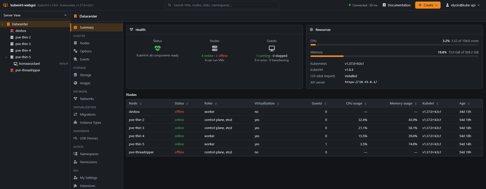

# kubevirt-webgui documentation

A Proxmox-shaped web interface for KubeVirt: a resource tree on the left, the
selected object's panels in the middle, the task log along the bottom. Every
action travels over one WebSocket, and every request is made with the
signed-in user's own Kubernetes credential.

## Getting started

| Page | What it covers |
|---|---|
| [Installation](installation.md) | what the cluster needs, Helm, plain manifests, running it on a laptop, putting it behind an Ingress |
| [Authentication and permissions](authentication.md) | signing in, tickets, how RBAC decides everything, handing out access |
| [Configuration](configuration.md) | every environment variable and the chart value that sets it |

## Features

| Page | What it covers |
|---|---|
| [Virtual machines](features/virtual-machines.md) | every panel of the VM screen, power actions, consoles, hardware, cloud-init, live migration, snapshots and clones |
| [Storage, disks and images](features/storage.md) | storage classes, the image library, uploads, disks, hotplug, resize, clone, CSI snapshots |
| [Networking](features/networking.md) | pod network versus Multus, NICs, exposing a VM as a Service, NetworkPolicy firewalls |
| [Datacenter](features/datacenter.md) | the cluster screens: nodes, options and feature gates, events, instance types, migrations, permissions, extensions |
| [Nodes](features/nodes.md) | node panels, cordon, drain, capabilities, CPU models and what they mean for migration |
| [Namespaces](features/namespaces.md) | namespaces as resource pools, quotas, permissions, firewalls |
| [USB devices](features/usb.md) | passthrough across nodes with atomic-usb, claims, boot hold |
| [Importing from Proxmox VE](features/proxmox-import.md) | the import wizard, what is mapped, how a disk is copied, what does not come across |
| [Tasks and progress](features/tasks.md) | the task log, UPIDs, live progress, stopping a task |

## Extending it

| Page | What it covers |
|---|---|
| [The gateway protocol](extending/gateway-protocol.md) | the frames, the method and topic catalogue, driving it from a script |
| [Server extensions](extending/server-extensions.md) | adding methods, topics and tasks in Rust; API discovery |
| [Browser plugins](extending/browser-plugins.md) | panels, actions, tree views and create-menu entries; runtime plugins with no rebuild |

## Running it

| Page | What it covers |
|---|---|
| [Architecture](architecture.md) | how the two halves fit together, watches, discovery, what is deliberately absent |
| [Development](development.md) | the dev loop, the checks CI runs, the e2e suite, building the image, releasing |
| [Troubleshooting](troubleshooting.md) | what to check when something is missing, refused, stuck or slow |

## The short version

- **Nothing is stored.** No database, no state on disk. Everything lives in
  Kubernetes, which is also what backs it up.
- **The server has no privileges.** Its ServiceAccount is bound to nothing; it
  acts as whoever signed in. Installing it cannot widen anybody's access.
- **The GUI is assembled from what the cluster has.** API discovery decides
  which screens exist, while it runs — no CDI means no image library, not a
  broken one.
- **Long operations are tasks.** They return immediately, log every step, and
  report progress, the way Proxmox's task viewer does.
