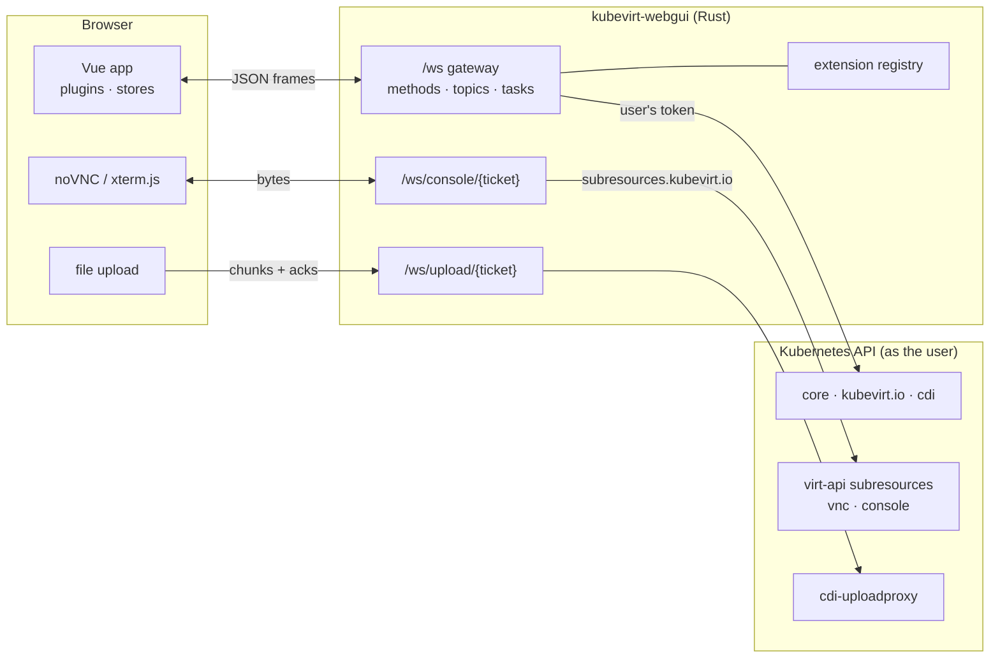

# Architecture

Two programs that share one protocol: a Rust server that is a thin, careful
proxy to the Kubernetes API, and a Vue application that is entirely built from
plugins. Neither stores anything.

- [The shape of it](#the-shape-of-it)
- [The server](#the-server)
- [The browser app](#the-browser-app)
- [Watches, not polling](#watches-not-polling)
- [Discovery drives the GUI](#discovery-drives-the-gui)
- [Tasks](#tasks)
- [Consoles and uploads](#consoles-and-uploads)
- [What is deliberately absent](#what-is-deliberately-absent)

## The shape of it

The important line is `gw -->|user's token| api`. The server never holds a
privileged credential of its own; see [authentication](authentication.md).

## The server

| Module | What it is |
|---|---|
| `bootstrap.rs` | boots the framework, registers routes, builds the extension registry |
| `gateway/` | `/ws` (the gateway), `/ws/console/{ticket}`, `/ws/upload/{ticket}` |
| `rpc.rs` | the vocabulary: methods, topics, the context they run in, error shapes |
| `auth.rs` | sign-in, sealed tickets, per-user Kubernetes clients |
| `cluster/` | API path building and validation, discovery, list-then-watch |
| `extensions/` | one module per feature area, each registering methods and topics |
| `tasks.rs` | tasks: UPID, log, progress, status |
| `proxmox/` | SSH, Proxmox config parsing, the import pipeline |
| `spa.rs` | serves the built browser app, and runtime plugins from `GUI_PLUGIN_DIR` |
| `metrics.rs` | parsing Kubernetes quantities for the metrics topics |

Every call arrives on the gateway, is dispatched to a method registered by an
extension, and runs as its own task — a slow call cannot block the socket
(`src/gateway/mod.rs`).

API paths are built from validated segments (`cluster/paths.rs`). A name
containing `/`, `?` or `..` is rejected before any request is made, which is
why a resource name can be passed straight from the browser without becoming a
way to reach a different endpoint.

## The browser app

Vue 3, Pinia, Tailwind, Font Awesome, noVNC and xterm.js. The layout follows
Proxmox VE: a resource tree on the left, the selected object's panels in the
middle, the task log along the bottom.

What matters architecturally is that **the built-in screens are plugins**.
`web/src/plugins/core/` registers the Datacenter, Node, Namespace, VM and Disk
screens through exactly the API a third-party plugin uses — panels, actions,
tree views, create-menu entries, object kinds. There is no privileged path a
plugin cannot take, because the screens you see already took it. See
[browser plugins](extending/browser-plugins.md).

## Watches, not polling

Every list in the GUI is a subscription. The server does list-then-watch the
way an informer does (`src/cluster/watch.rs`): the first event is a `SYNC` with
the full list, then `ADDED`/`MODIFIED`/`DELETED` as they happen. When the API
server expires a resource version (`410 Gone`), the server lists again and
sends a fresh `SYNC`; a subscriber never learns that the watch restarted.

Watches are per user, because they are made with the user's credential. There
is no shared cache of objects, so there is nothing to leak between users and
nothing to invalidate when RBAC changes — a user who loses access stops
receiving events because the API server stops sending them.

## Discovery drives the GUI

The one thing that *is* shared and cached is discovery — which API groups and
resources the cluster serves — because it is the same for everybody
(`src/cluster/discovery.rs`).

Both halves use it:

- **The server** refuses a method belonging to an extension whose APIs are
  missing, with `ExtensionUnavailable` and a message naming what is missing,
  rather than an opaque failure deeper down. It rescans before refusing, so a
  CRD installed a minute ago is picked up.
- **The browser** re-reads discovery every minute. A plugin whose requirements
  appear is set up at once; one whose requirements disappear has its panels,
  actions and tree views withdrawn and its `teardown()` called. No reload.

This is why the same build works on a bare Kubernetes cluster, on one with
KubeVirt but no CDI, and on one with everything: the GUI is assembled from
what the cluster actually has.

## Tasks

Anything that takes longer than a request returns a task id immediately, and
reports through the `tasks` topic: a log line per step, optional progress, and
a final status. The id is a Proxmox-style UPID, and the task log is the one
place where a long operation explains itself.

Tasks live in the server's memory. A restart loses the log, not the work: the
Kubernetes objects the task created carry on. See [tasks](features/tasks.md).

## Consoles and uploads

Both carry bytes rather than JSON, and both use the two-step ticket pattern
Proxmox uses: ask on the authenticated socket, connect with the ticket.

- **Consoles.** `console.ticket` returns a single-use ticket; `/ws/console/{ticket}`
  becomes a raw pipe to KubeVirt's `vnc` or `console` subresource, opened with
  the user's own credential.
- **Uploads.** `upload.begin` returns a ticket; the browser streams the file to
  `/ws/upload/{ticket}` in acknowledged chunks, and the server forwards it to
  CDI's upload proxy with a CDI upload token. Nothing is buffered to disk on
  the way through.

## What is deliberately absent

| Not here | Why |
|---|---|
| A database | there is no state worth keeping; everything is in Kubernetes |
| A user store | the cluster already has one, and RBAC decides everything |
| A privileged ServiceAccount | the server acts as the user, never as itself |
| A REST API for the browser | one socket, one authentication, one place authorisation is applied |
| Server-side caching of objects | per-user watches cannot leak between users |
| Leader election or replicas coordinating | any replica can serve any browser; tasks are the only per-process state |
